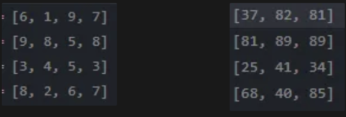

## 벌통 채취 🐝🍯

### 📌 유형

- 완전 탐색 (완탐)
- DFS
- 가지치기?

---

### 📌 고려사항

✅ **문제 지문이 다소 지저분함**

✅ **M개의 벌집 중에서 C 이하의 양만큼 채집할 때, 가치의 최댓값을 구하는 문제** ← 비문학임??

---

### 📌 문제의 조건

- **벌꿀의 합이 제약사항**
- **제약사항을 지키는 선에서 가치의 최댓값을 구해야 함**
    
    ### 🚨 예시
    
    | 선택한 벌꿀 합 | 가치 계산 |
    | --- | --- |
    | 9 | 81 (= 9²) |
    | 5 + 4 | 25 + 16 (= 5² + 4²) |
    
    ❌ **문제를 잘못 읽으면 합이 같은 경우 `41`로 가치 갱신할 가능성이 있음**
    

---

### 📌 그래서 값의 최댓값은 어케 구함?

1. **가로로 M개의 벌집 선택**
2. **M개의 벌집 중에서 꿀을 채취할 벌집을 선택 (혹은 선택하지 않음)**
    - `0-1 냅색` 사용 가능
3. **선택한 벌꿀의 합이 C 이하라면 가치 계산 후 최댓값 갱신**
4. **벌집 M개를 모두 확인했으면 종료**

```python
if sum <= C:
  temp_max_honey = max(temp_max_honey, sum_power_honey)
if index == M:
  return
```

> 🚨 index == M을 코드 상단에 두면 한 번도 확인하지 않고 종료할 수도 있으니 주의!
> 



- 왼쪽의 벌집 배열이 오른쪽의 값의 최댓값 배열로 변함
- `n = 4`, `M = 2`, `C = 10`

---

### 📌 일꾼 두 명이 꿀을 채취할 때 최댓값

- **벌통이 겹치면 안 됨**
    - 단순 정렬 후 최상위 두 개를 선택하는 방식 ❌
    - 조합으로 해결하는 방식 ❌
- **4중 반복문 사용 (`(i, j)`, `(k, l)`)**
    - `i, j`: 첫 번째 일꾼의 벌통 위치
    - `k, l`: 두 번째 일꾼의 벌통 위치

### 🎯 벌통이 겹치지 않도록 조건 설정

- `i - k` (행 조건)
    - 벌통 선택이 가로 방향이므로 **세로 위치(i)는 크게 신경 쓰지 않아도 됨**
    - `i = 0 ~ N`, `k = i ~ N`
    - 유일하게 벌통이 겹칠 가능성이 있는 경우 → `i == k`
- `j - l` (열 조건)
    - `j, l = 0 ~ (N - M + 1)`
    - 벌통이 M개씩 선택되므로 **`l - j < M`이면 겹침**

---

### 📌 후기 📝

- **가치의 최댓값 구하는 부분 때문에 고민을 많이 함**
- **재귀 없이도 풀릴 것 같은데...**
- **`0-1 냅색` 익혀두니까 여기저기서 유용하게 써먹는듯**
- **별개로 문제 지문 왤케 더러움?**
- **무슨말하는지 이해하기 좀 힘들었음**