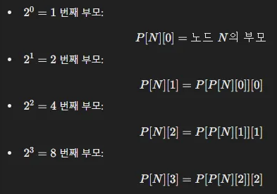

# 공통조상

## 고려사항

### 노드

- 그냥 리스트 인덱스로 해도 될거 같긴 한데 구현은 노드로 하는게 편한듯
- 탐색도, 가독성도?

### 최소공통조상

- 기본은 두 노드의 높이를 같게 하고 올려가며 탐색
    - → 노드들의 높이 저장할 필요 있음
- 시간 빡빡하면 한칸씩 올리는게 아니라 $2^k$ 조상 배열을 저장해서 탐색하는듯?
    - parent = [1번째, 2번째, 4번째 …]
        
        
        
    - 즉, $2^k$번째 부모는 $2^{k-1}$번째 부모 노드의 $2^{k-1}$번째 부모다
    - P[N][K] = P[ P[N][K−1] ][ K−1 ]
        - N번째 노드의 $2^k$번째 부모
        - N번째 노드의 $2^{k-1}$번째 부모 노드의 $2^{k-1}$번째 부모
    - 높이를 맞추고 같은 조상을 찾을때까지 동시에 올라가는 O(N)이 O(logN)으로 단축됨
    
    ## 후기
    
    - 최소공통조상 검색 좀 해보고 풀었는데 $2^k$ 부모배열 아직도 이해가 잘 안됨
    - 점화식은 이해했는데 마지막에 parent[a][k] parent[b][k]가 다를 때만 점프하면 LCA 바로 아래까지 도달해서 parent[a][0]이 답이라는데 우째서…?